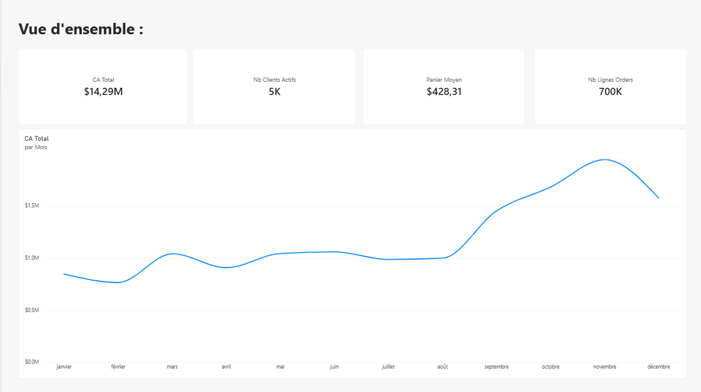
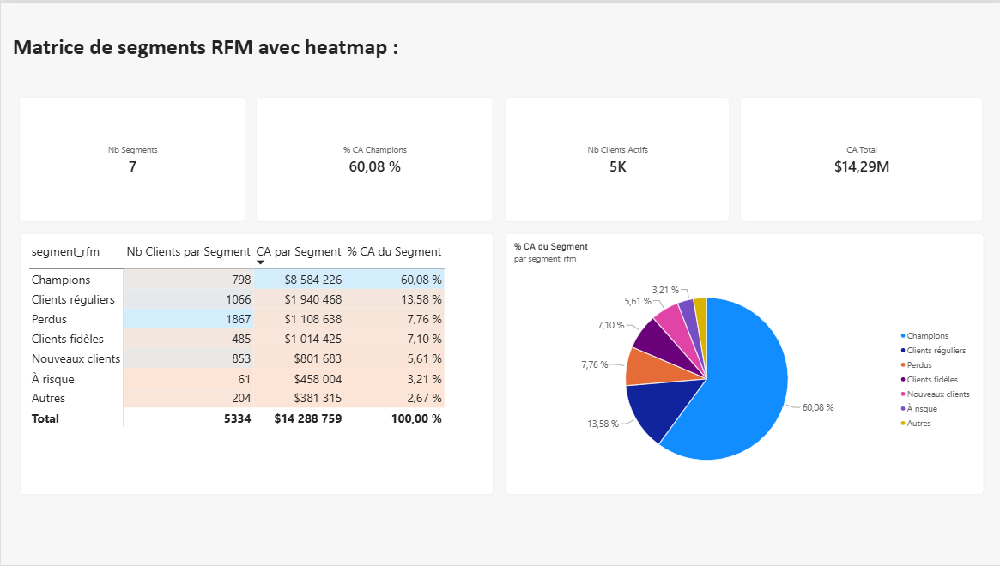
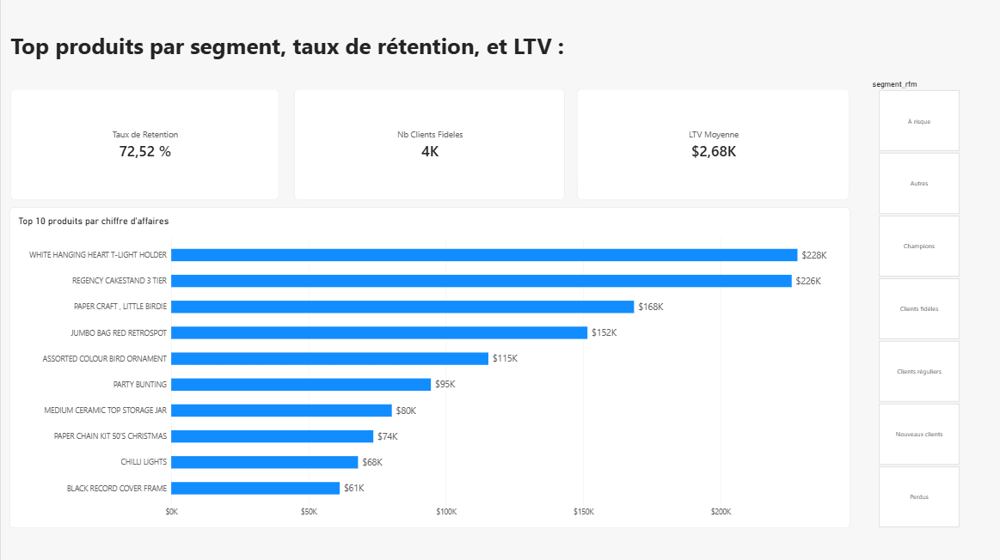

# Dashboard Power BI — Segmentation RFM

Ce dashboard visualise les résultats de la segmentation RFM et du clustering K-Means calculés dans le notebook (`notebooks/online_retail.ipynb`) et en SQL (`sql/rfm_cte.sql`).

## Connexion aux données

Le fichier `retail_dashboard.pbix` se connecte à des fichiers CSV exportés dans `data/processed/` (non versionnés dans ce repo, cf. README principal pour les régénérer). La connexion directe à la base SQLite via ODBC a présenté des erreurs de transaction non résolues avec le driver disponible,les données ont donc été chargées via export CSV, une méthode plus stable pour ce cas d'usage où un rafraîchissement en temps réel n'était pas nécessaire.

## Page 1 — Vue d'ensemble

Indicateurs clés : chiffre d'affaires total (14,29M £), nombre de clients actifs (5 334), panier moyen (428 £), et nombre total de lignes de commande. La courbe de CA mensuel confirme le pic saisonnier de novembre déjà identifié en exploration (section 3 du notebook), avec une montée progressive à partir de septembre.

## Page 2 — Matrice de segments RFM avec heatmap

Matrice croisant les 7 segments RFM (Champions, Perdus, Clients fidèles...) avec le nombre de clients et leur part de chiffre
d'affaires, complétée par un diagramme circulaire. La mise en forme conditionnelle met en évidence la forte concentration de valeur sur le segment Champions : 15% des clients (798) génèrent 60% du chiffre d'affaires total.

## Page 3 — Détail par segment

Top 10 produits par chiffre d'affaires, taux de rétention global (72,5%), nombre de clients fidèles et LTV moyenne. Un slicer sur le segment RFM permet de filtrer dynamiquement le top produits et recalculer les indicateurs pour un segment spécifique.

## Limites connues

- Connexion statique via CSV plutôt que connexion live à la base SQLite (cf. section "Connexion aux données" ci-dessus).
- Le calcul du taux de rétention et de la LTV se base sur les données du dataset complet (2009-2011) ; aucune notion de période glissante n'est appliquée.